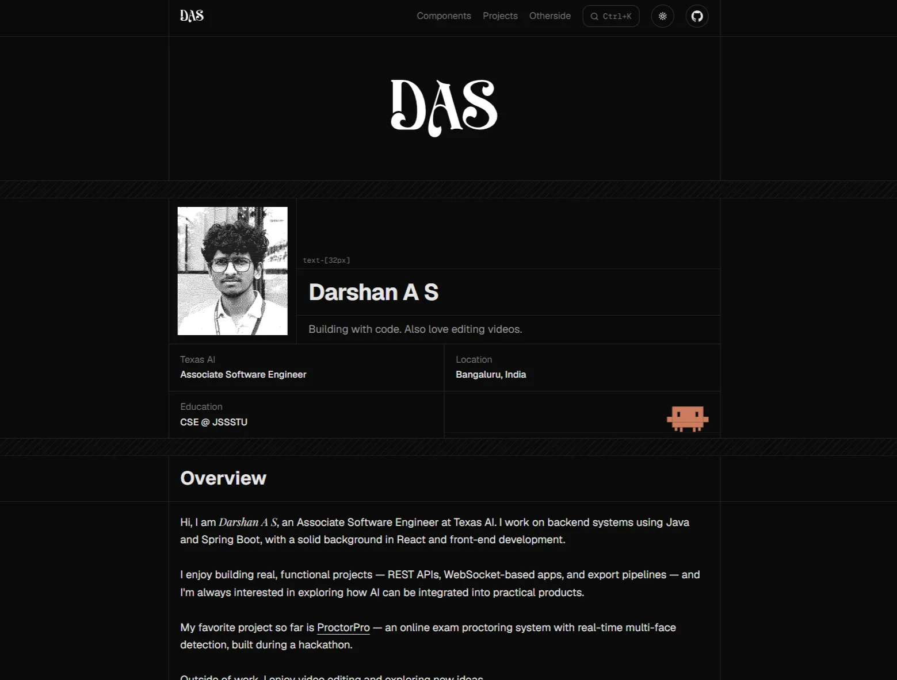

# dasfolio


A minimal dev portfolio by Darshan A S — a software engineer, video editor, and Design Engineer in the making.

→ Live site: [das-folio.in](https://das-folio.in)

[](https://das-folio.in)

## Overview

### Stack

- React 19 + Vite 7
- Tailwind CSS v4 (`@tailwindcss/vite`)
- shadcn/ui
- React Router v7
- Motion (React) for animations

### Featured

- Clean, minimal single-column layout with full-width borders and vertical rails
- Light/Dark themes — system preference fallback, localStorage persistence, `D` key toggle
- Command search modal with 30+ indexed items (`Ctrl/Cmd + K`)
- Interactive horizontal timeline (2004–2026) with spring hover images
- LeetCode contribution graph with submission counts and tooltips
- Video editing showcase with hover-to-play previews and audio
- Component docs showcase at `/components` — live preview, code snippets, copy-to-clipboard
- SEO optimized (JSON-LD schema, OG tags, sitemap, robots)
- AI-ready with [/llms.txt](https://llmstxt.org)
- Analytics & Speed Insights with Vercel

### Keyboard Shortcuts

| Key | Action |
|-----|--------|
| `Ctrl/Cmd + K` | Search modal (30+ items, keyboard nav, cross-page hash) |
| `Ctrl/Cmd + '` | Timeline modal |
| `Ctrl/Cmd + Q` | Quote modal |
| `Ctrl/Cmd + I` | Scroll to top |
| `Ctrl + Shift + D` | Go to home (`/`) |
| `Ctrl + Alt + D` | Go to the Dino game (`/das`) |
| `D` | Toggle dark mode |

### Pages

- `/` — Home page with all sections
- `/components` — Documented UI components (live preview + code)
- `/components/:slug` — Individual component docs
- `/otherside` — Video editing showcase with hover-to-play audio, lazy-loaded via IntersectionObserver
- `*` — 404 page with a playable Chrome Dino easter egg

## Development

```bash
npm install
npm run dev
```

Open [http://localhost:5173](http://localhost:5173)

| Command | Description |
|---------|-------------|
| `npm run dev` | Start dev server |
| `npm run build` | Production build |
| `npm run preview` | Preview production build |
| `npm run lint` | Run ESLint |

## Project Structure

```
src/
├── assets/          # SVGs, fonts, videos, images
├── components/      # React components
│   ├── ui/          # shadcn/ui components
│   └── ...          # Section & utility components
├── pages/           # Route pages (Home, Otherside, Components, Docs)
├── data/            # Content data (projects, UI components)
├── lib/             # Utilities (cn helper)
├── App.jsx          # Root layout with routing
├── index.css        # Tailwind entry + CSS variables
└── main.jsx         # React entry (BrowserRouter)
```

## Deployment

Deployed on Vercel. `vercel.json` rewrites all routes to `index.html` for client-side routing (while letting static assets through).
